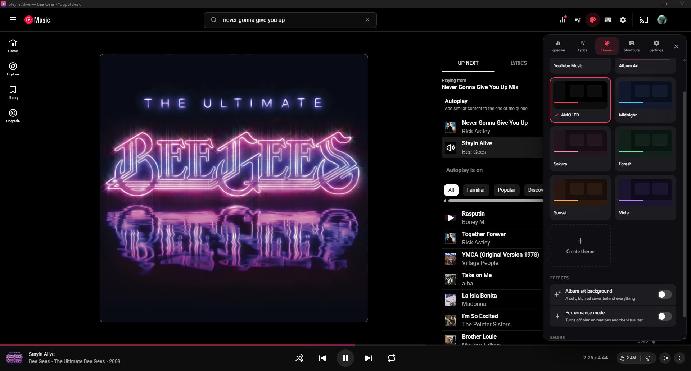

<div align="center">


# YouputDesk

**A desktop app for YouTube Music on Windows**, with an equalizer, synced lyrics, themes, a mini player and global hotkeys.

[](https://github.com/roderio/youputdesk/releases/latest)
[](https://github.com/roderio/youputdesk/releases)
[](https://github.com/microsoft/winget-pkgs/tree/master/manifests/r/roderio/YouputDesk)
[](https://github.com/roderio/youputdesk/actions/workflows/ci.yml)
[](LICENSE)

### [⬇ Download for Windows](https://github.com/roderio/youputdesk/releases/latest) · [Website](https://roderio.github.io/youputdesk/)


</div>

YouputDesk runs the real music.youtube.com, so Google sign-in, your library and Premium all work as usual.
It then adds what the browser tab can't do:

| | |
| --- | --- |
| **Equalizer**: 10 bands, presets, bass boost, loudness normalization and a limiter so boosts never distort |  |
| **Synced lyrics**: line by line from [LRCLIB](https://lrclib.net), click a line to jump there, full-screen mode |  |
| **Themes**: built-in palettes, an "Album Art" theme that follows the cover, a theme editor, import/export |  |
| **Tray and mini player**: keeps playing when closed; a small always-on-top player you can drag anywhere |  |

Plus:

- **Shortcuts**: in-app and global hotkeys, all rebindable, with conflict warnings (`Ctrl+/` lists them)
- **Ad alerts**: a banner and Windows notification when an ad plays, with one-key skip when YouTube allows it
- **Windows integration**: taskbar play/pause buttons and progress, media keys and the Windows media overlay
- **Discord**: "Listening to…" status
- **Private by default**: no accounts, no analytics, and nothing leaves your PC until you allow it

## Install

Pick whichever you like. All of them work on Windows 10 and 11, on both Intel/AMD (x64) and ARM PCs.

**Installer** (recommended): download **`YouputDesk-Setup-<version>.exe`** from the
[latest release](https://github.com/roderio/youputdesk/releases/latest) and open it. It installs in a few
seconds without admin rights and updates itself.

**winget:**

```powershell
winget install roderio.YouputDesk
```

**Scoop:**

```powershell
scoop bucket add roderio https://github.com/roderio/scoop-bucket
scoop install youputdesk
```

**Portable:** download `YouputDesk-<version>-portable.exe` (or the smaller `-x64` / `-arm64` one for your PC)
and run it from anywhere, even a USB stick. It keeps its data in a `YouputDesk-data` folder beside the exe and
doesn't update itself. Your Google sign-in is encrypted for your Windows account, so on another PC you'll be
asked to sign in again.

To uninstall, go to Windows Settings → Apps (or `winget uninstall` / `scoop uninstall`). Uninstalling also
removes all of YouputDesk's data.

## FAQ

**Windows says "Windows protected your PC". Is it safe?**
The installer isn't code-signed yet, so SmartScreen doesn't recognize it. Click **More info → Run anyway**.
Releases are built only by GitHub Actions from this public source code, and they'll be signed through the
SignPath Foundation once the project's application is approved (see the
[code signing policy](#code-signing-policy)). Installing with winget or Scoop skips this dialog.

**Does YouTube Music Premium work?**
Yes. It's the real YouTube Music website, so signing in with your Google account works as it does in a browser.

**Why not just use the browser or the installable web app?**
They can't add an equalizer, synced lyrics, global hotkeys, a tray mini player, ad alerts or Discord status.
YouputDesk adds them without changing anything about your account.

**Does it block ads?**
No. It tells you when an ad starts and lets you skip with one key when YouTube shows a Skip button.

**Something broke after YouTube Music changed. What now?**
[Open an issue](https://github.com/roderio/youputdesk/issues/new/choose). YouTube Music changes its page
from time to time, and fixes reach installed copies through the automatic updater.

## Privacy & security

No accounts, no analytics, no tracking. The first time it opens, YouputDesk asks which optional features
may talk to other services (Discord status, online lyrics, update checks), and nothing is sent until you
choose. See [PRIVACY.md](PRIVACY.md) for exactly what goes where, and [SECURITY.md](SECURITY.md) for how the
app is hardened and how to report a vulnerability.

If Google ever refuses sign-in ("This browser or app may not be secure"), press `Alt` →
**App → Sign-in identity** and try another option.

## Contributing

Bug reports, ideas and pull requests are welcome. See [CONTRIBUTING.md](CONTRIBUTING.md) to build and run
it locally, and [Discussions](https://github.com/roderio/youputdesk/discussions) for questions and shared themes.
If you like YouputDesk, a ⭐ helps other people find it.

## Code signing policy

Free code signing for Windows releases is provided by [SignPath.io](https://about.signpath.io), with a
certificate from the [SignPath Foundation](https://signpath.org). *(Application pending: releases are unsigned
until it's approved.)*

- Only release builds made by GitHub Actions from this repository's tagged commits are signed. Nothing built
  on a personal machine is.
- Committers and reviewers: [roderio](https://github.com/roderio)
- Approvers: [roderio](https://github.com/roderio)
- Every team member uses multi-factor authentication for GitHub and SignPath.

**Privacy:** this program will not transfer any information to other networked systems unless specifically
requested by the user or the person installing or operating it. The optional features that contact other
services (Discord status, online lyrics, update checks) stay off until you allow them on first launch. See
[PRIVACY.md](PRIVACY.md).

## Disclaimer

YouputDesk is an independent open-source project. It is not affiliated with, endorsed by or sponsored by
Google LLC or YouTube. YouTube and YouTube Music are trademarks of Google LLC.
